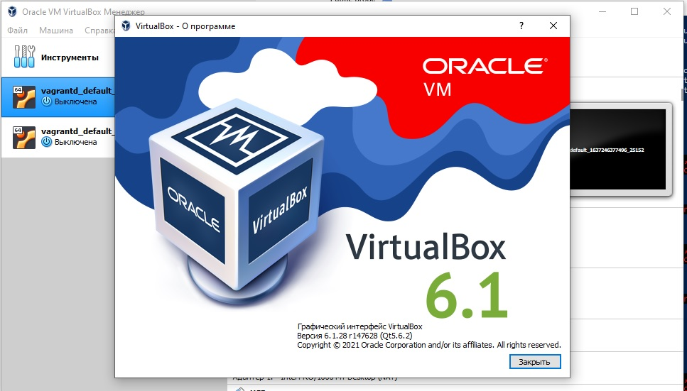

# Домашнее задание к занятию "5.2. Применение принципов IaaC в работе с виртуальными машинами"


## Обязательная задача 1
- Опишите своими словами основные преимущества применения на практике IaaC паттернов.
- Какой из принципов IaaC является основополагающим?

### Ответ:
Применение на практике IaaC паттернов позволяет ускорить процесс разработки программных продуктов за счет быстрого предоставления сред разработки, тестирования и продакшена.
Кроме того исключается вариант несовпадения версий программных сред на всех этапах разработки ПО, благодаря повторяемости конфигурации, основанной на основополагающем принципе IAAC - идемпотентности.
Идемпотентность - свойство объекта или операции, при повторном выполнении которой мы получаем результат, идентичный предыдущему и всем последующим выполнениям.

## Обязательная задача 2
- Чем Ansible выгодно отличается от других систем управление конфигурациями?
- Какой, на ваш взгляд, метод работы систем конфигурации более надёжный push или pull?

### Ответ:
Главное отличие Ansible от других подобных систем в том, что Ansible
использует существующую SSH инфраструктуру, в то время как
другие (Saltstack, Chef, Puppet, и пр.) требуют установки
специального PKI-окружения.

Метод pull требует наличия агента, установленного на нодах. 
На мой взгляд более надежным методом работы систем конфигурации является push, т.к. исключены
ошибки, связанные с агентской частью систем управления конфигурациями. 

## Обязательная задача 3
Установить на личный компьютер:

- VirtualBox
- Vagrant
- Ansible

Приложить вывод команд установленных версий каждой из программ, оформленный в markdown.

### Ответ

Версия VirtualBox


Версия Vagrant 
```
PS C:\Users\User\.vagrant.d> vagrant version
Installed Version: 2.2.19
Latest Version: 2.2.19

You're running an up-to-date version of Vagrant!
```

Версия Ansible
```root@vagrant:/home/vagrant# root@vagrant:/home/vagrant# ansible --version
ansible 2.9.6
  config file = /etc/ansible/ansible.cfg
  configured module search path = ['/root/.ansible/plugins/modules', '/usr/share/ansible/plugins/modules']
  ansible python module location = /usr/lib/python3/dist-packages/ansible
  executable location = /usr/bin/ansible
  python version = 3.8.10 (default, Jun  2 2021, 10:49:15) [GCC 9.4.0]
```