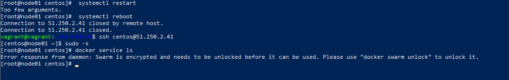

# Домашнее задание к занятию "5.5. Оркестрация кластером Docker контейнеров на примере Docker Swarm"


## Обязательная задача 1
Дайте письменые ответы на следующие вопросы:

- В чём отличие режимов работы сервисов в Docker Swarm кластере: replication и global?
- Какой алгоритм выбора лидера используется в Docker Swarm кластере?
- Что такое Overlay Network?

### Ответ
Для replication сервиса вы указываете, сколько идентичных задач хотите запустить.
Например, вы решили развернуть сервис HTTP с тремя репликами, каждая из которых обслуживает
один и тот же контент.

Глобальный сервис — это сервис, который запускает одну задачу на каждой ноде.
Предварительно заданного количества задач нет.
Каждый раз, когда вы добавляете ноду в swarm, оркестратор создает задачу,
а планировщик назначает задачу новой ноде.

B Docker Swarm кластере используется алгоритм поддержания распределенного консенсуса — Raft.

Overlay-сети используются в контексте кластеров (Docker Swarm),
где виртуальная сеть, которую используют контейнеры, связывает несколько физических хостов,
на которых запущен Docker. 

## Обязательная задача 2
Создать ваш первый Docker Swarm кластер в Яндекс.Облаке

Для получения зачета, вам необходимо предоставить скриншот из терминала (консоли), с выводом команды:
```
docker node ls
```
### Ответ


## Обязательная задача 3
Создать ваш первый, готовый к боевой эксплуатации кластер мониторинга, состоящий из стека микросервисов.

Для получения зачета, вам необходимо предоставить скриншот из терминала (консоли), с выводом команды:

```
docker service ls
```
### Ответ


## Необязательная задача 4
Выполнить на лидере Docker Swarm кластера команду (указанную ниже) и дать письменное описание её функционала, что она делает и зачем она нужна:

```
# см.документацию: https://docs.docker.com/engine/swarm/swarm_manager_locking/
docker swarm update --autolock=true
```

### Ответ

Данная команда инициирует docker swarm с бключенной автоблокировкой нод с ролью manager.


После рестарта Docker необходимо разблокировать swarm для возможности управления им.



Для этого нужно ввести команду

```
docker swarm unlock
```
и ввести пароль, сохраненный при инициировании docker swarm


Это сделано в целях безопасности, для защиты TLS ключа шифрования и ключа шифрования логов Raft.


Для выключения автоблокировки нужно ввести команду
```
docker swarm update --autolock=false
```