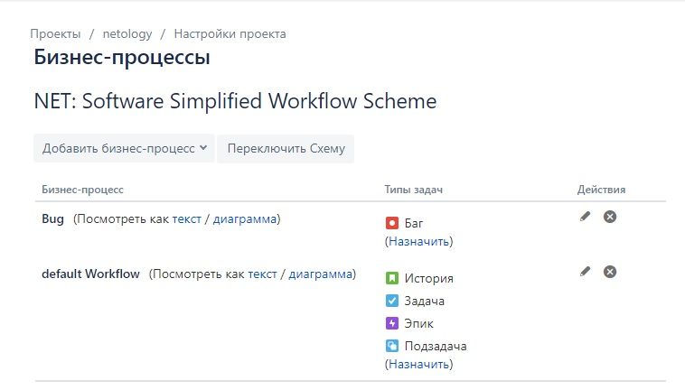
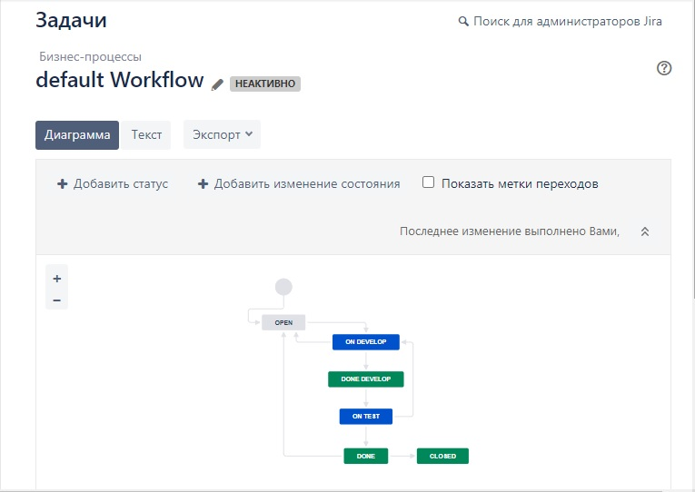
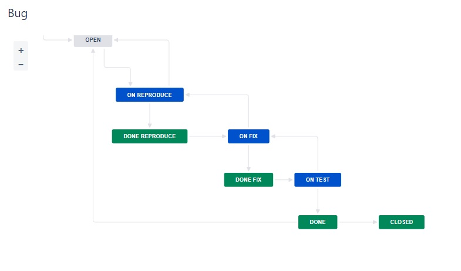
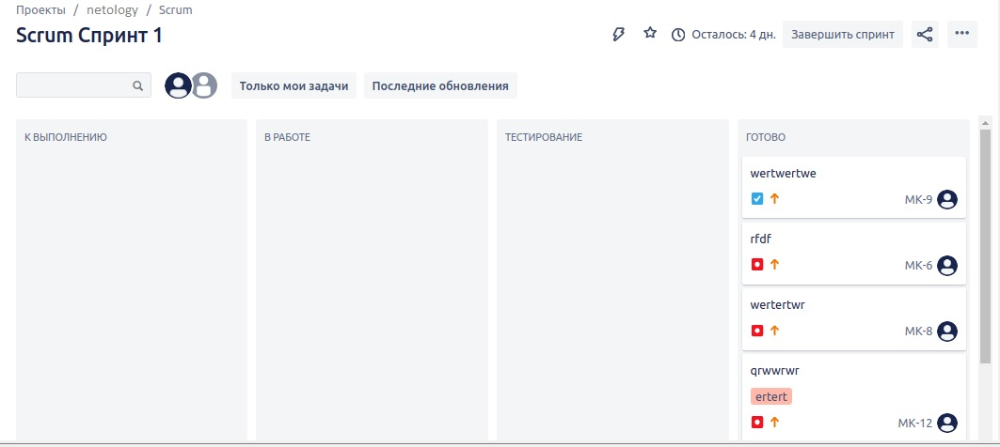
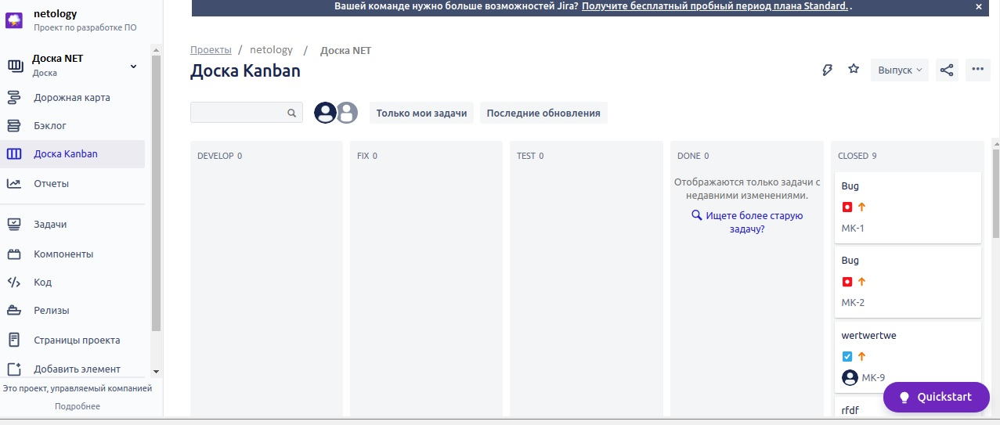

# Домашнее задание к занятию "9.1 Жизненный цикл ПО"

## Основная часть.

### Ответ:

Схемы:
[Bug.xml - для багов](https://github.com/sdg75/devops-netology/blob/main/Jira/Bug.xml)
[default Workflow.xml - для остальных](https://github.com/sdg75/devops-netology/blob/main/Jira/default%20Workflow.xml)

Скрины:

