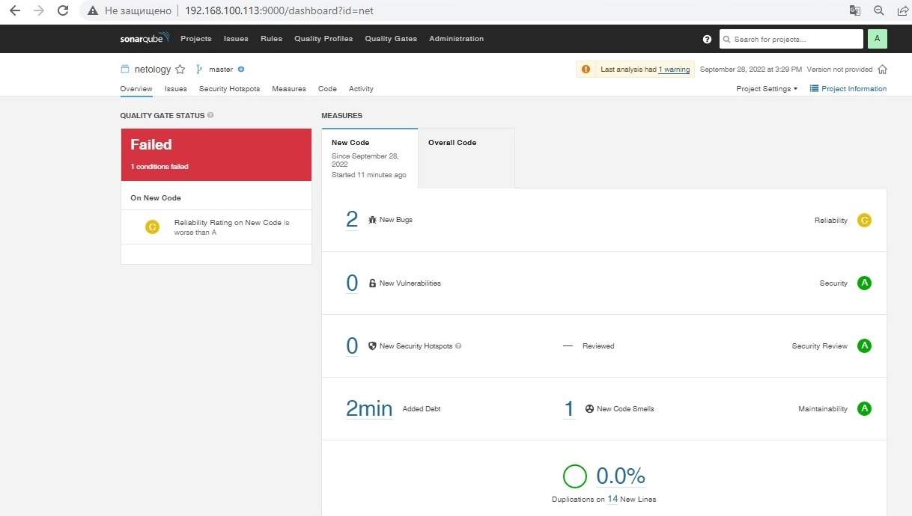
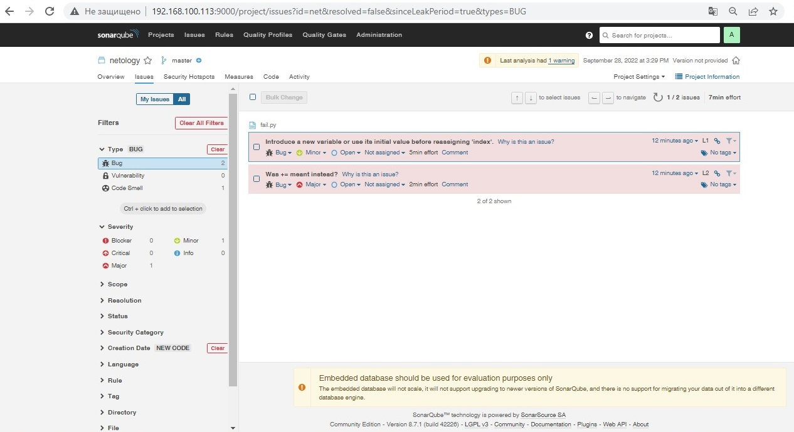
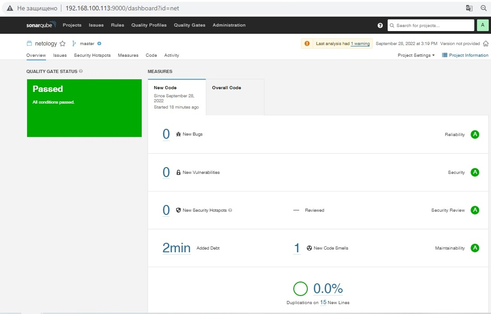
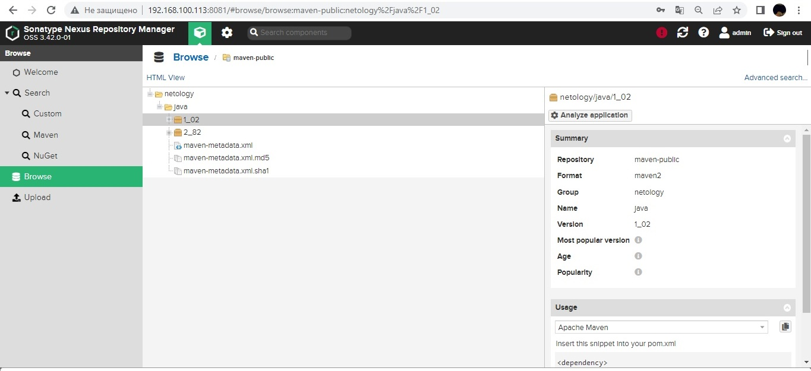
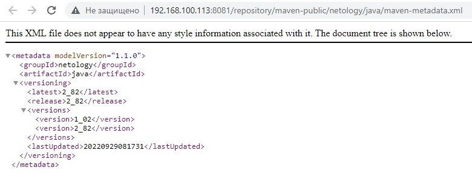

**# Домашнее задание к занятию "9.2 CI\CD"

## 1. Знакомоство с SonarQube

### Ответ:

1й запуск - с ошибкой




Перечень ошибок



2й запуск - ошибки устранены




## 2. Знакомство с Nexus

### Ответ:

Скрины:







Файл [maven-metadata.xml](https://github.com/sdg75/devops-netology/blob/main/cicd/maven-metadata.xml)


## 3. Знакомство с Maven

### Ответ:

Появившийся артефакт:

```
sdg@ntl01:~$ ls -la ~/.m2/repository/netology/java/2_82/
total 32
drwxrwxr-x 2 sdg sdg 4096 сен 29 08:39 .
drwxrwxr-x 3 sdg sdg 4096 сен 29 08:34 ..
-rw-rw-r-- 1 sdg sdg  382 сен 29 08:34 java-2_82-distrib.tar.gz.lastUpdated
-rw-rw-r-- 1 sdg sdg  417 сен 29 08:34 java-2_82.pom
-rw-rw-r-- 1 sdg sdg   40 сен 29 08:34 java-2_82.pom.sha1
-rw-rw-r-- 1 sdg sdg  116 сен 29 08:39 java-2_82.tar.gz
-rw-rw-r-- 1 sdg sdg   40 сен 29 08:39 java-2_82.tar.gz.sha1
-rw-rw-r-- 1 sdg sdg  185 сен 29 08:39 _remote.repositories
```

[исправленный pom.xml](https://github.com/sdg75/devops-netology/blob/main/cicd/pom.xml)
