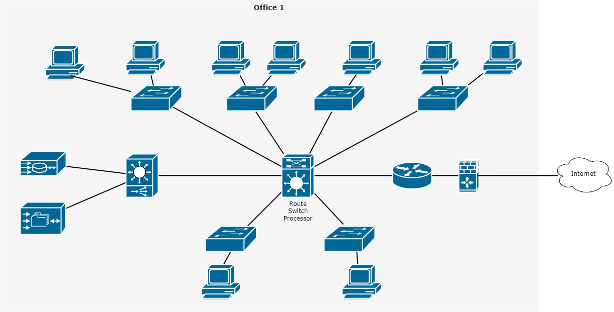

1. Результат выполнения команд:
```
route-views>show ip route 77.40.96.58
Routing entry for 77.40.0.0/17
  Known via "bgp 6447", distance 20, metric 0
  Tag 3356, type external
  Last update from 4.68.4.46 09:38:08 ago
  Routing Descriptor Blocks:
  * 4.68.4.46, from 4.68.4.46, 09:38:08 ago
      Route metric is 0, traffic share count is 1
      AS Hops 2
      Route tag 3356
      MPLS label: none
```
```
route-views>show bgp 77.40.96.58
BGP routing table entry for 77.40.0.0/17, version 2919136557
Paths: (23 available, best #7, table default)
  Not advertised to any peer
  Refresh Epoch 1
  6939 12389
    64.71.137.241 from 64.71.137.241 (216.218.252.164)
      Origin IGP, localpref 100, valid, external
      path 7FE12C7ADD68 RPKI State valid
      rx pathid: 0, tx pathid: 0
  Refresh Epoch 1
  1351 6939 12389
    132.198.255.253 from 132.198.255.253 (132.198.255.253)
      Origin IGP, localpref 100, valid, external
      path 7FE122E0A870 RPKI State valid
      rx pathid: 0, tx pathid: 0
  Refresh Epoch 1
  20912 3257 3356 12389
    212.66.96.126 from 212.66.96.126 (212.66.96.126)
      Origin IGP, localpref 100, valid, external
      Community: 3257:8070 3257:30515 3257:50001 3257:53900 3257:53902 20912:65004
      path 7FE0DC91BAC8 RPKI State valid
      rx pathid: 0, tx pathid: 0
  Refresh Epoch 1
  3333 1103 12389
    193.0.0.56 from 193.0.0.56 (193.0.0.56)
      Origin IGP, localpref 100, valid, external
      path 7FE0CB2590E8 RPKI State valid
      rx pathid: 0, tx pathid: 0
  Refresh Epoch 2
  8283 1273 12389
    94.142.247.3 from 94.142.247.3 (94.142.247.3)
      Origin IGP, metric 0, localpref 100, valid, external
      Community: 1273:12276 1273:32090 8283:1 8283:101 8283:103
      unknown transitive attribute: flag 0xE0 type 0x20 length 0x24
        value 0000 205B 0000 0000 0000 0001 0000 205B
              0000 0005 0000 0001 0000 205B 0000 0005
              0000 0003
      path 7FE0C22B18A0 RPKI State valid
      rx pathid: 0, tx pathid: 0
  Refresh Epoch 1
  53767 14315 6453 6453 3356 12389
    162.251.163.2 from 162.251.163.2 (162.251.162.3)
      Origin IGP, localpref 100, valid, external
      Community: 14315:5000 53767:5000
      path 7FE113AF4BB0 RPKI State valid
      rx pathid: 0, tx pathid: 0
  Refresh Epoch 1
  3356 12389
    4.68.4.46 from 4.68.4.46 (4.69.184.201)
      Origin IGP, metric 0, localpref 100, valid, external, best
      Community: 3356:2 3356:22 3356:100 3356:123 3356:501 3356:901 3356:2065
      path 7FE1103282A8 RPKI State valid
      rx pathid: 0, tx pathid: 0x0
  Refresh Epoch 1
  20130 6939 12389
    140.192.8.16 from 140.192.8.16 (140.192.8.16)
      Origin IGP, localpref 100, valid, external
      path 7FE018873A38 RPKI State valid
      rx pathid: 0, tx pathid: 0
  Refresh Epoch 1
  3549 3356 12389
    208.51.134.254 from 208.51.134.254 (67.16.168.191)
      Origin IGP, metric 0, localpref 100, valid, external
      Community: 3356:2 3356:22 3356:100 3356:123 3356:501 3356:901 3356:2065 3549:2581 3549:30840
      path 7FE0CC2F49E0 RPKI State valid
      rx pathid: 0, tx pathid: 0
  Refresh Epoch 1
  101 174 12389
    209.124.176.223 from 209.124.176.223 (209.124.176.223)
      Origin IGP, localpref 100, valid, external
      Community: 101:20100 101:20110 101:22100 174:21101 174:22005
      Extended Community: RT:101:22100
      path 7FE0C002A668 RPKI State valid
      rx pathid: 0, tx pathid: 0
  Refresh Epoch 1
  852 3356 12389
    154.11.12.212 from 154.11.12.212 (96.1.209.43)
      Origin IGP, metric 0, localpref 100, valid, external
      path 7FE01B4F1FC0 RPKI State valid
      rx pathid: 0, tx pathid: 0
  Refresh Epoch 1
  57866 3356 12389
    37.139.139.17 from 37.139.139.17 (37.139.139.17)
      Origin IGP, metric 0, localpref 100, valid, external
      Community: 3356:2 3356:22 3356:100 3356:123 3356:501 3356:901 3356:2065
      path 7FE14F27B9F8 RPKI State valid
      rx pathid: 0, tx pathid: 0
  Refresh Epoch 1
  2497 12389
    202.232.0.2 from 202.232.0.2 (58.138.96.254)
      Origin IGP, localpref 100, valid, external
      path 7FE0C9E57468 RPKI State valid
      rx pathid: 0, tx pathid: 0
  Refresh Epoch 1
  4901 6079 3356 12389
    162.250.137.254 from 162.250.137.254 (162.250.137.254)
      Origin IGP, localpref 100, valid, external
      Community: 65000:10100 65000:10300 65000:10400
      path 7FE0344BF520 RPKI State valid
      rx pathid: 0, tx pathid: 0
  Refresh Epoch 3
  3303 12389
    217.192.89.50 from 217.192.89.50 (138.187.128.158)
      Origin IGP, localpref 100, valid, external
      Community: 3303:1004 3303:1006 3303:1030 3303:3056
      path 7FE14323AA30 RPKI State valid
      rx pathid: 0, tx pathid: 0
  Refresh Epoch 1
  7660 2516 12389
    203.181.248.168 from 203.181.248.168 (203.181.248.168)
      Origin IGP, localpref 100, valid, external
      Community: 2516:1050 7660:9001
      path 7FE0A85A1EC8 RPKI State valid
      rx pathid: 0, tx pathid: 0
  Refresh Epoch 1
  7018 3356 12389
    12.0.1.63 from 12.0.1.63 (12.0.1.63)
      Origin IGP, localpref 100, valid, external
      Community: 7018:5000 7018:37232
      path 7FE0B48D0250 RPKI State valid
      rx pathid: 0, tx pathid: 0
  Refresh Epoch 1
  49788 12552 12389
    91.218.184.60 from 91.218.184.60 (91.218.184.60)
      Origin IGP, localpref 100, valid, external
      Community: 12552:12000 12552:12100 12552:12101 12552:22000
      Extended Community: 0x43:100:1
      path 7FE14A800E90 RPKI State valid
      rx pathid: 0, tx pathid: 0
  Refresh Epoch 1
  1221 4637 12389
    203.62.252.83 from 203.62.252.83 (203.62.252.83)
      Origin IGP, localpref 100, valid, external
      path 7FE0203DADA0 RPKI State valid
      rx pathid: 0, tx pathid: 0
  Refresh Epoch 1
  701 1273 12389
    137.39.3.55 from 137.39.3.55 (137.39.3.55)
      Origin IGP, localpref 100, valid, external
      path 7FE02DC87A40 RPKI State valid
      rx pathid: 0, tx pathid: 0
  Refresh Epoch 1
  3257 3356 12389
    89.149.178.10 from 89.149.178.10 (213.200.83.26)
      Origin IGP, metric 10, localpref 100, valid, external
      Community: 3257:8794 3257:30043 3257:50001 3257:54900 3257:54901
      path 7FE149FEC8B0 RPKI State valid
      rx pathid: 0, tx pathid: 0
  Refresh Epoch 1
  3561 3910 3356 12389
    206.24.210.80 from 206.24.210.80 (206.24.210.80)
      Origin IGP, localpref 100, valid, external
      path 7FE17E00E388 RPKI State valid
      rx pathid: 0, tx pathid: 0
  Refresh Epoch 1
  19214 174 12389
    208.74.64.40 from 208.74.64.40 (208.74.64.40)
      Origin IGP, localpref 100, valid, external
      Community: 174:21101 174:22005
      path 7FE18006B788 RPKI State valid
      rx pathid: 0, tx pathid: 0
```

2. Создадим интерфейс:
```
root@vagrant:/home/vagrant# ip -br a
lo               UNKNOWN        127.0.0.1/8 ::1/128
eth0             UP             10.0.2.15/24 fe80::a00:27ff:fe73:60cf/64
dummy0           UNKNOWN        10.2.2.2/32 fe80::4005:17ff:fe03:9182/64
```

Добавим пару маршрутов. Результат:
```
root@vagrant:/home/vagrant# ip route list
default via 10.0.2.2 dev eth0 proto dhcp src 10.0.2.15 metric 100
10.0.2.0/24 dev eth0 proto kernel scope link src 10.0.2.15
10.0.2.2 dev eth0 proto dhcp scope link src 10.0.2.15 metric 100
10.2.2.0/24 via 10.2.2.2 dev dummy0
172.16.11.0/24 via 10.2.2.2 dev dummy0
```

3. Проверим открытые TCP порты в Ubuntu:
```
root@vagrant:/home/vagrant# ss -lt
State        Recv-Q       Send-Q               Local Address:Port                 Peer Address:Port       Process
LISTEN       0            4096                       0.0.0.0:sunrpc                    0.0.0.0:*
LISTEN       0            4096                 127.0.0.53%lo:domain                    0.0.0.0:*
LISTEN       0            128                        0.0.0.0:ssh                       0.0.0.0:*
LISTEN       0            4096                          [::]:sunrpc                       [::]:*
LISTEN       0            128                           [::]:ssh                          [::]:*
```

4. Проверим открытые UDP порты:
```
root@vagrant:/home/vagrant# ss -lu
State        Recv-Q       Send-Q               Local Address:Port                 Peer Address:Port       Process
UNCONN       0            0                    127.0.0.53%lo:domain                    0.0.0.0:*
UNCONN       0            0                   10.0.2.15%eth0:bootpc                    0.0.0.0:*
UNCONN       0            0                          0.0.0.0:sunrpc                    0.0.0.0:*
UNCONN       0            0                             [::]:sunrpc                       [::]:*
```

5. Диаграмма сети:
