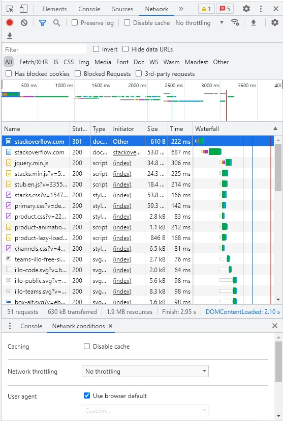
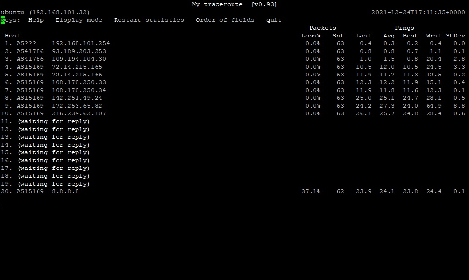

**1.** Полученный HTTP-код:
```
HTTP/1.1 301 Moved Permanently
cache-control: no-cache, no-store, must-revalidate
location: https://stackoverflow.com/questions
```
Означает постоянный редирект на адрес, указанный в location.
В данном случае это https://stackoverflow.com/questions

**2.** Полученный HTTP код
```
Request URL: http://stackoverflow.com/
Request Method: GET
Status Code: 301 Moved Permanently
```
Дольше всего обрабатывался запрос на открытие URL https://stackoverflow.com - 687ms



**3.** Текущий адрес - 109.194.108.132

**4.** Провайдер - JSC "ER-Telecom Holding" Yoshkar-Ola Branch,  AS41786

**5.**
```
sdg@ubuntu:~$ traceroute -An 8.8.8.8
traceroute to 8.8.8.8 (8.8.8.8), 30 hops max, 60 byte packets
 1  192.168.101.254 [*]  0.205 ms  0.228 ms  0.240 ms
 2  * * *
 3  109.194.104.30 [AS41786]  1.038 ms  1.011 ms  0.989 ms
 4  72.14.215.165 [AS15169]  10.897 ms  10.875 ms  10.822 ms
 5  72.14.215.166 [AS15169]  11.717 ms  11.689 ms  11.656 ms
 6  * * *
 7  108.170.250.33 [AS15169]  11.959 ms 172.253.69.88 [AS15169]  11.917 ms 108.170.227.70 [AS15169]  10.870 ms
 8  108.170.250.113 [AS15169]  11.466 ms  11.452 ms 108.170.250.34 [AS15169]  11.855 ms
 9  209.85.255.136 [AS15169]  30.367 ms 142.251.49.24 [AS15169]  26.090 ms *
10  172.253.65.159 [AS15169]  27.222 ms 108.170.235.64 [AS15169]  25.099 ms 108.170.235.204 [AS15169]  27.524 ms
11  216.239.58.65 [AS15169]  28.832 ms 142.250.210.103 [AS15169]  27.820 ms 108.170.233.161 [AS15169]  26.813 ms
12  * * *
13  * * *
14  * * *
15  * * *
16  * * *
17  * * *
18  * * *
19  * * *
20  * * *
21  8.8.8.8 [AS15169]  27.114 ms *  26.933 ms
```
**6.** mtr -zn 8.8.8.8



Наибольшая задержка на 9 хосте.

**7.** Авторизованные DNS-сервера:
```
dns.google.             21600   IN      NS      ns3.zdns.google.
dns.google.             21600   IN      NS      ns2.zdns.google.
dns.google.             21600   IN      NS      ns4.zdns.google.
dns.google.             21600   IN      NS      ns1.zdns.google.
```
A-записи:
```
dns.google.             846     IN      A       8.8.4.4
dns.google.             846     IN      A       8.8.8.8
```
**8.**  dig -x 8.8.8.8
```
4.4.8.8.in-addr.arpa.   62406   IN      PTR     dns.google.
8.8.8.8.in-addr.arpa.   17661   IN      PTR     dns.google.
```