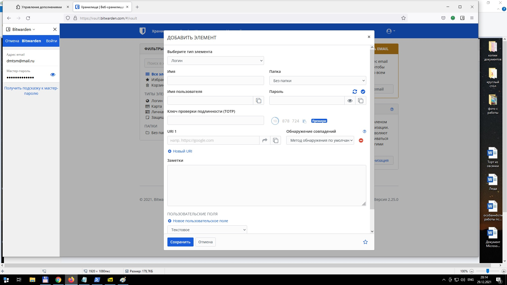
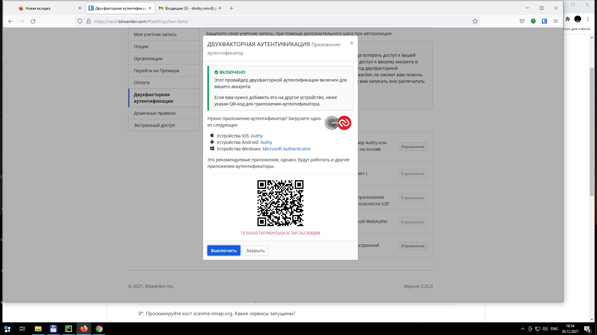
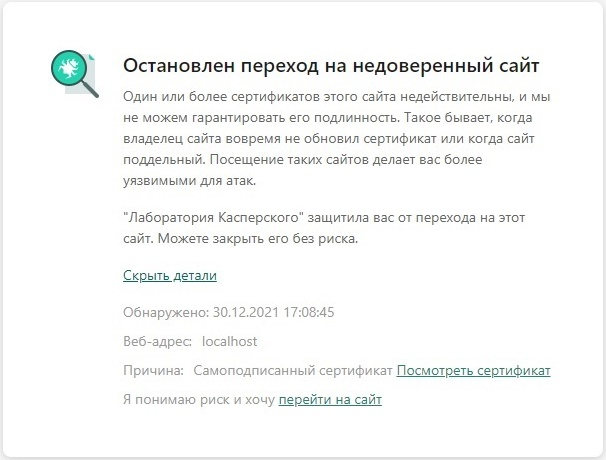
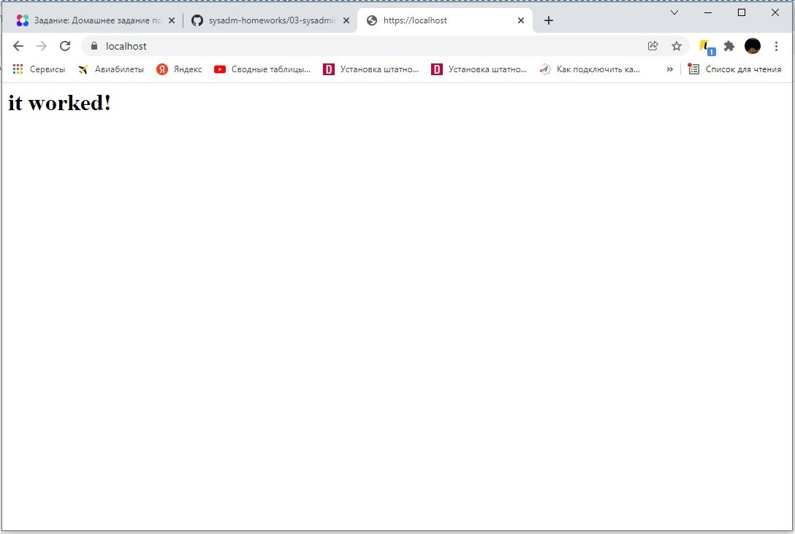
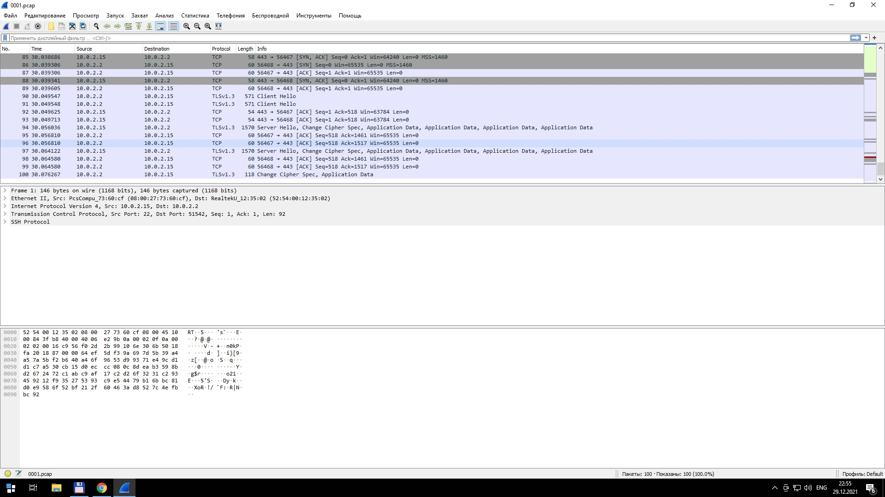

1. Выполнено


2. Выполнено


3. Устанавливаем apache2, включаем поддержку ssl:
```
sudo apt install apache2
sudo a2enmod ssl
sudo systemctl restart apache2
```
Генерируем самоподписанный сертификат:
```
sudo openssl req -x509 -nodes -days 365 -newkey rsa:2048 \
-keyout /etc/ssl/private/apache-selfsigned.key \
-out /etc/ssl/certs/apache-selfsigned.crt \
-subj "/C=RU/ST=Moscow/L=Moscow/O=Company Name/OU=Org/CN=www.example.com"
```
Настройки сайта:
```
root@vagrant:/etc/apache2/sites-available# cat /etc/apache2/sites-available/example.com.conf
<VirtualHost *:443>
        ServerName example.com
        DocumentRoot /var/www/example.com
        SSLEngine on
        SSLCertificateFile /etc/ssl/certs/apache-selfsigned.crt
        SSLCertificateKeyFile /etc/ssl/private/apache-selfsigned.key
</VirtualHost>
```
Текст самой страницы:
```
root@vagrant:/etc/apache2/sites-available# cat /var/www/example.com/index.html
<h1>it worked!</h1>
```
Активируем страницу, выполнаем релоад apache2:
```
sudo a2ensite your_domain_or_ip.conf
sudo apache2ctl configtest
sudo systemctl reload apache2
```
Антивирус ругается на самоподписанный сертификат:


но страница всеже открывается


4. Выполнаем проверку на уязвимости:
```
vagrant@vagrant:~/testssl.sh$ ./testssl.sh -U --sneaky https://www.google.com/

###########################################################
    testssl.sh       3.1dev from https://testssl.sh/dev/
    (3827521 2021-12-27 17:11:36 -- )

      This program is free software. Distribution and
             modification under GPLv2 permitted.
      USAGE w/o ANY WARRANTY. USE IT AT YOUR OWN RISK!

       Please file bugs @ https://testssl.sh/bugs/

###########################################################

 Using "OpenSSL 1.0.2-chacha (1.0.2k-dev)" [~183 ciphers]
 on vagrant:./bin/openssl.Linux.x86_64
 (built: "Jan 18 17:12:17 2019", platform: "linux-x86_64")


 Start 2021-12-29 18:27:59        -->> 216.58.209.164:443 (www.google.com) <<--

 rDNS (216.58.209.164):  hem09s02-in-f4.1e100.net. bud02s21-in-f164.1e100.net. bud02s21-in-f4.1e100.net.
 Service detected:       HTTP


 Testing vulnerabilities

 Heartbleed (CVE-2014-0160)                not vulnerable (OK), no heartbeat extension
 CCS (CVE-2014-0224)                       not vulnerable (OK)
 Ticketbleed (CVE-2016-9244), experiment.  not vulnerable (OK)
 ROBOT                                     not vulnerable (OK)
 Secure Renegotiation (RFC 5746)           supported (OK)
 Secure Client-Initiated Renegotiation     not vulnerable (OK)
 CRIME, TLS (CVE-2012-4929)                not vulnerable (OK)
 BREACH (CVE-2013-3587)                    potentially NOT ok, "br gzip" HTTP compression detected. - only supplied "/" tested
                                           Can be ignored for static pages or if no secrets in the page
 POODLE, SSL (CVE-2014-3566)               not vulnerable (OK)
 TLS_FALLBACK_SCSV (RFC 7507)              Downgrade attack prevention supported (OK)
 SWEET32 (CVE-2016-2183, CVE-2016-6329)    VULNERABLE, uses 64 bit block ciphers
 FREAK (CVE-2015-0204)                     not vulnerable (OK)
 DROWN (CVE-2016-0800, CVE-2016-0703)      not vulnerable on this host and port (OK)
                                           make sure you don't use this certificate elsewhere with SSLv2 enabled services
                                           https://censys.io/ipv4?q=0298F617D11DA008B87DC59F932885BF2108F97C605E48E6AB166170610B39D7 could help you to find out
 LOGJAM (CVE-2015-4000), experimental      not vulnerable (OK): no DH EXPORT ciphers, no DH key detected with <= TLS 1.2
 BEAST (CVE-2011-3389)                     TLS1: ECDHE-ECDSA-AES128-SHA ECDHE-ECDSA-AES256-SHA ECDHE-RSA-AES128-SHA
                                                 ECDHE-RSA-AES256-SHA AES128-SHA AES256-SHA DES-CBC3-SHA
                                           VULNERABLE -- but also supports higher protocols  TLSv1.1 TLSv1.2 (likely mitigated)
 LUCKY13 (CVE-2013-0169), experimental     potentially VULNERABLE, uses cipher block chaining (CBC) ciphers with TLS. Check patches
 Winshock (CVE-2014-6321), experimental    not vulnerable (OK)
 RC4 (CVE-2013-2566, CVE-2015-2808)        no RC4 ciphers detected (OK)


 Done 2021-12-29 18:28:43 [  48s] -->> 216.58.209.164:443 (www.google.com) <<--

```

5. Выполнено:
```
vagrant@vagrant:~/.ssh$ ssh sdg@192.168.101.32
Welcome to Ubuntu 20.04.3 LTS (GNU/Linux 5.4.0-91-generic x86_64)

 * Documentation:  https://help.ubuntu.com
 * Management:     https://landscape.canonical.com
 * Support:        https://ubuntu.com/advantage

  System information as of Ср 29 дек 2021 19:12:37 UTC

  System load:  0.0                Processes:               213
  Usage of /:   23.0% of 19.56GB   Users logged in:         1
  Memory usage: 13%                IPv4 address for ens160: 192.168.101.32
  Swap usage:   0%
```

6. Создадим файл с конфигурацией:
```
vagrant@vagrant:~$ cat .ssh/config
Host ubuntu
HostName 192.168.101.32
Port 22
User sdg
IdentityFile ~/.ssh/ssh_ubuntu_rsa_key
```
Подключимся:
```
vagrant@vagrant:~/.ssh$ ssh ubuntu
Welcome to Ubuntu 20.04.3 LTS (GNU/Linux 5.4.0-91-generic x86_64)

 * Documentation:  https://help.ubuntu.com
 * Management:     https://landscape.canonical.com
 * Support:        https://ubuntu.com/advantage

  System information as of Ср 29 дек 2021 19:35:12 UTC

  System load:  0.0                Processes:               213
  Usage of /:   23.0% of 19.56GB   Users logged in:         1
  Memory usage: 13%                IPv4 address for ens160: 192.168.101.32
  Swap usage:   0%

43 updates can be applied immediately.
To see these additional updates run: apt list --upgradable

Last login: Wed Dec 29 19:32:38 2021 from 10.8.0.100
```
7. Соберем дамп:
```
vagrant@vagrant:~$ sudo tcpdump -c 100 -w 0001.pcap -i eth0
tcpdump: listening on eth0, link-type EN10MB (Ethernet), capture size 262144 bytes
100 packets captured
129 packets received by filter
0 packets dropped by kernel
```
Откроем полученный дамп Wireshark:
