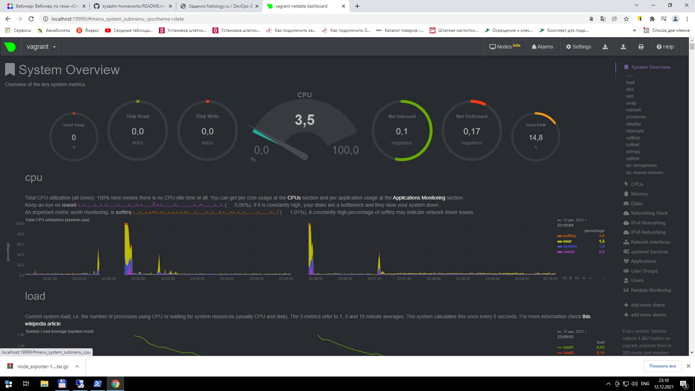

1. node_exporter скачан и установлен, пробрасываем порт 9100 наружу:

config.vm.network "forwarded_port", guest: 9100, host: 9100, host_ip: "127.0.0.1"

unit-файл для node_exporter:

root@vagrant:/etc# cat /lib/systemd/system/node_exporter.service

[Unit]

Description=Node Exporter

DefaultDependencies=no

[Service]

ExecStart=/home/vagrant/node_exporter-1.3.1.linux-amd64/node_exporter $OPTIONS

ExecStop=/bin/kill -HUP $MAINPID

EnvironmentFile=-/etc/node_exporter

[Install]

WantedBy=multi-user.target

Используя внешний файл опций, включим ntp-collector, который по-умолчанию выключен:

root@vagrant:/etc# cat /etc/node_exporter

OPTIONS="--collector.ntp"

Поместим в автозагрузку:

root@vagrant:/etc# systemctl enable node_exporter

Запустим node_exporter:

root@vagrant:/etc# systemctl start node_exporter

Проверим статус:

root@vagrant:/etc# systemctl status node_exporter

● node_exporter.service - Node Exporter

     Loaded: loaded (/lib/systemd/system/node_exporter.service; enabled; vendor preset: enabled)

     Active: active (running) since Mon 2021-12-13 18:22:32 UTC; 5min ago

   Main PID: 2344 (node_exporter)

      Tasks: 5 (limit: 1071)

     Memory: 4.9M

     CGroup: /system.slice/node_exporter.service

             └─2344 /home/vagrant/node_exporter-1.3.1.linux-amd64/node_exporter --collector.ntp

Перезапуск и остановка также работают:

root@vagrant:/etc# systemctl restart node_exporter

root@vagrant:/etc# systemctl stop node_exporter

2.CPU:

node_cpu_seconds_total{cpu="0",mode="idle"} 5727.89

node_cpu_seconds_total{cpu="0",mode="iowait"} 2.09

node_cpu_seconds_total{cpu="0",mode="irq"} 0

node_cpu_seconds_total{cpu="0",mode="nice"} 0.1

node_cpu_seconds_total{cpu="0",mode="softirq"} 1.68

node_cpu_seconds_total{cpu="0",mode="steal"} 0

node_cpu_seconds_total{cpu="0",mode="system"} 61.82

node_cpu_seconds_total{cpu="0",mode="user"} 42.27

RAM:

node_memory_MemAvailable_bytes 6.29538816e+08

node_memory_MemFree_bytes

HDD:

node_disk_io_time_seconds_total{device="sda"} 14.152000000000001

node_disk_read_time_seconds_total{device="sda"} 8.91

node_disk_write_time_seconds_total{device="sda"} 2.624

NIC:

node_network_receive_bytes_total{device="eth0"} 1.367848e+06

node_network_transmit_bytes_total{device="eth0"} 557302

node_network_receive_errs_total{device="eth0"} 0

node_network_transmit_errs_total{device="eth0"} 0

3. Пакет Netdata установлен, порт 19999 проброшен на хостовую машину.

root@vagrant:/etc# lsof -i :19999

COMMAND PID    USER   FD   TYPE DEVICE SIZE/OFF NODE NAME

netdata 704 netdata    4u  IPv4  25019      0t0  TCP *:19999 (LISTEN)

В браузере на хостовой машине:

4. Ответ - да

root@vagrant:/etc# dmesg | grep virt

[    0.010442] CPU MTRRs all blank - virtualized system.

[    0.191148] Booting paravirtualized kernel on KVM

[    3.156830] systemd[1]: Detected virtualization oracle.

5. fs.nr_open - Лимит на количество открытых дескрипторов.

root@vagrant:/etc# cat /proc/sys/fs/nr_open

1048576

Начать стоит с проверки ulimit -a и ulimit -aH в shell'е. Это быстро покажет текущие "мягкие" и (второй вызов) "жесткие" ограничения. При помощи ulimit можно открутить мягкие ограничения до пределов жестких. Следует понимать, что ulimit меняет только текущие лимиты, для шелла и всех программ, запущенных в этом шелле, поэтому после завершения сессии или даже в другом окне терминала значения останутся прежними.

Следующее место задания ограничений, на этот раз постоянных — это /etc/security/limits.conf и каталог /etc/security/limits.d/, ограничение называется nofile. Редактировать (а, иногда, и смотреть) эти файлы может только суперпользователь ("root"). Там задаются ограничения на отдельных пользователей или группы, применяемые на всю сессию данного пользователя, или всех пользователей определенной группы.

И наконец, есть "системное ограничение", задаваемое через sysctl - это fs.nr_open:

/sbin/sysctl -n fs.nr_open

ему же соответствует файл /proc/sys/fs/nr_open

6. Ответ:

root@vagrant:~# screen

root@vagrant:~# unshare -f --pid --mount-proc /usr/bin/sleep 1h

root@vagrant:/home/vagrant# root@vagrant:/home/vagrant# ps aux | grep sleep

root        1165  0.0  0.0   8080   524 pts/1    S+   19:24   0:00 unshare -f --pid --mount-proc /usr/bin/sleep 1h

root        1166  0.0  0.0   8076   532 pts/1    S+   19:24   0:00 /usr/bin/sleep 1h

Переключимся в созданный namespace и посмотрим список процессов:

root@vagrant:~# nsenter --target 1166 --pid --mount

root@vagrant:/# ps aux

USER         PID %CPU %MEM    VSZ   RSS TTY      STAT START   TIME COMMAND

root           1  0.0  0.0   8076   532 pts/1    S+   19:24   0:00 /usr/bin/sleep 1h

root           2  0.0  0.3   9836  3984 pts/0    S    19:26   0:00 -bash

root          11  0.0  0.3  11492  3368 pts/0    R+   19:26   0:00 ps aux

7. Конструкция :(){ :|:& };: определяет функцию с именем : , которая порождает саму себя (дважды, один канал переходит в другой) и создает фон.

Это так называемая forkbomb - плодит бесчисленное множество процессов, загружая центральный процессор.

При запуске на некоторое время теряется контроль над системой - экран забит сообщениями

-bash: fork: Resource temporarily unavailable

Через некоторое время система стабилизируется и команду можно прервать.

Вывод dmesg:

[  783.251487] cgroup: fork rejected by pids controller in /user.slice/user-1000.slice/session-1.scope

Сработал механизм ограничения числа процессов, создаваемых пользователем:

vagrant@vagrant:~$ cat /sys/fs/cgroup/pids/user.slice/user-1000.slice/pids.max

2356

С помощью команды ulimit и конфигурационного файла /etc/security/limits.conf можно ограничить процессам доступ к системным ресурсам, таким как память, файлы и процессор.

Например, ulimit -u NUMBER - ограничение максимального количества запущенных процессов числом NUMBER.